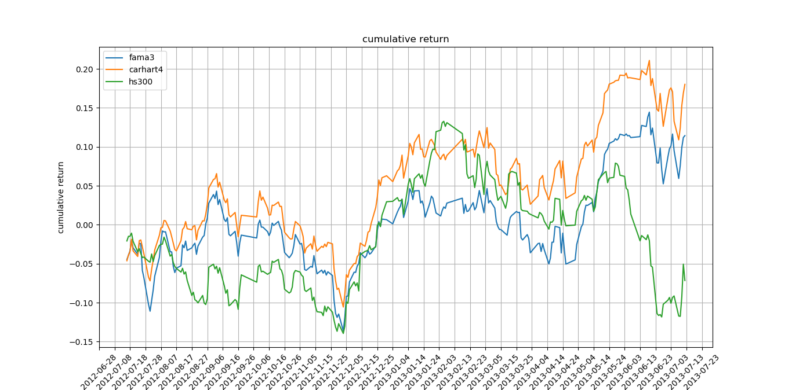
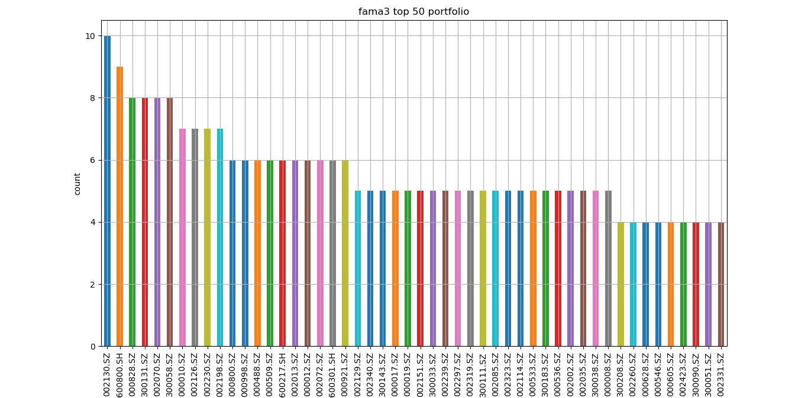
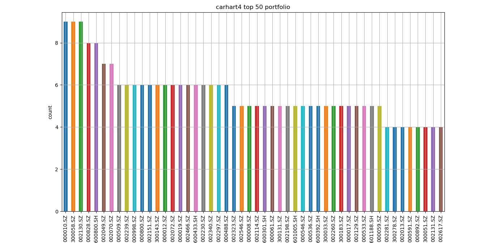
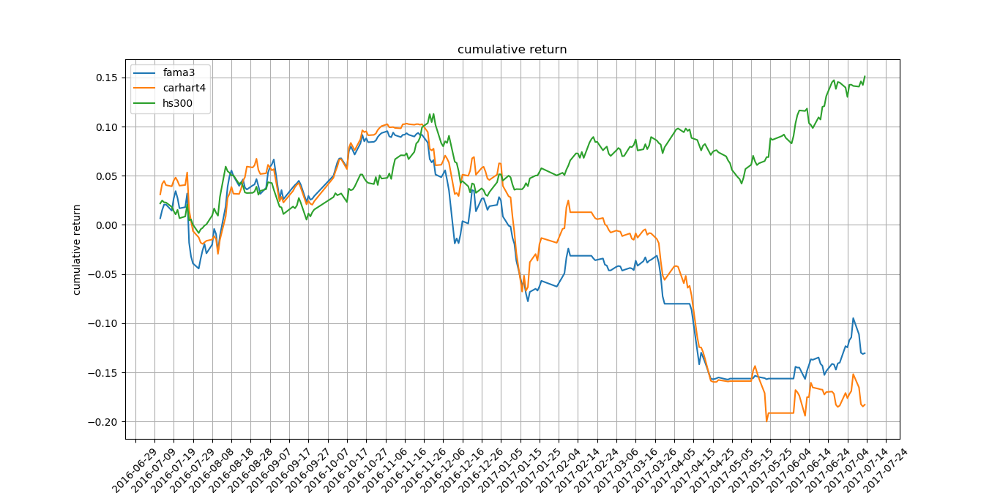
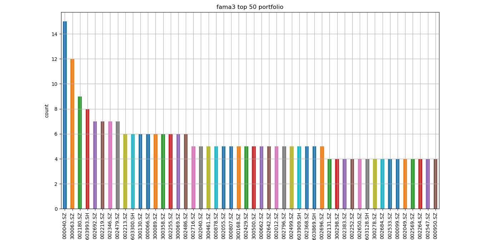
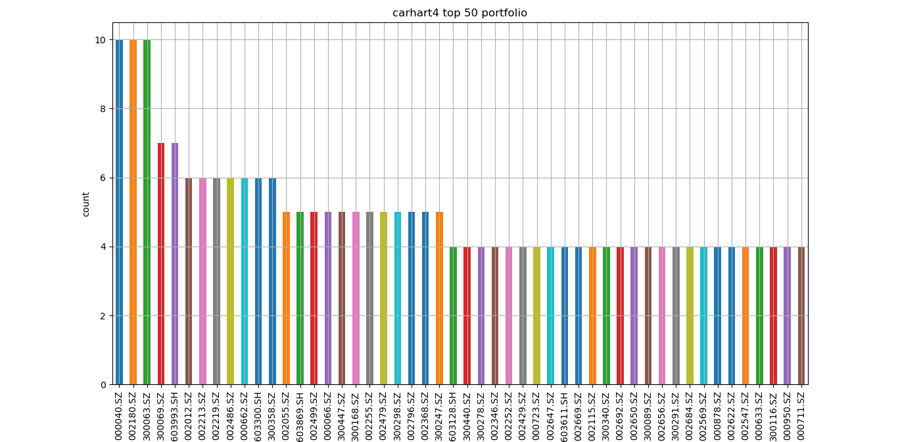

# 第一阶段任务总结及成果分析展示

### 完成的任务

#### 数据准备

1. 2008-09-01到2018-09-01上市公司股票日线数据（共3555只）
2. 2008-09-01到2018-09-01上市公司部分因子数据（剩下的因子第二阶段再去计算）
3. 2008-09-01到2018-09-01上市公司停复盘数据
4. 2008-09-01到2018-09-01上市公司复权因子数据（用户复权日线数据）
5. 2008-09-01到2018-09-01上市公司财务报表数据（第二阶段待用）
6. 2008-09-01到2018-09-01各指数日线数据（包含沪深300）

所有数据存放在perconaDB中．

#### 因子模型开发

该阶段主要完成了两个因子模型：Fama三因子和Carhart四因子．

Fama五因子打算放到下阶段完成，Fama五因子的投资水平因子需要利用财务报表去计算．

#### 回测流程开发

对开发的因子模型进行回测，基于的日线数据全是向后复权数据．

回测流程遇到的问题及解决方案：

1. 遇到股票停盘和复盘时，会出现投资组合中的某些股票当日收益率为Nan．

   解决方案：计算当日投资组合收益率时，停盘的股票不进行计算，但是加权平均时需要算上停盘股票的配比权重．

2. 遇到新股上市时，回归的时候会出现训练数据不足的问题．

   解决方案：当训练数据低于90条时不对该只股票进行回归打分

3. 遇到股票增发,配股,送股,拆股,转增资本时，股票价格会出现陡增或陡降．

   解决方案：使用向后复权数据

### 成果展示

#### 回测时间段2012-07-12到2013-07-13（回测时间一年）

累计收益率曲线：

回测结果分析：

|                   | carhart4 | fama3   | 沪深300 |
| ----------------- | -------- | ------- | ------- |
| cumulative return | 18.01%   | 11.44%  | -7.15%  |
| annual return     | 18.84%   | 11.96%  | -7.48%  |
| alpha             | 22.18%   | 15.54%  | 0.00%   |
| beta              | 62.21%   | 64.48%  | 100.00% |
| volatility        | 486.57%  | 485.85% | 506.95% |
| sharp ratio       | 3.87%    | 2.46%   | -1.48%  |
| information ratio | 10.19%   | 8.00%   | Nan     |
| max drawdown      | 248.47%  | 343.98% | 328.22% |

从上述分析结果可以看出carhart四因子模型和fama三因子模型的表现要优于沪深300，carhart四因子表现要优于fama三因子．（上述评价指标就不一一介绍了）．

持仓分析：

fama三因子模型2012到2013一年间持有过的股票总共有471只，持有次数最多的前50只股票分布如上图．

carhart四因子模型2012到2013一年间持有过的股票总共有492只，持有次数最多的前50只股票分布如上图．

#### 回测时间段2016-07-12到2017-07-13（回测时间一年）

回测结果分析：

|                   | carhart4 | fama3   | 沪深300 |
| ----------------- | -------- | ------- | ------- |
| cumulative return | -18.28%  | -13.04% | 15.10%  |
| annual return     | -18.65%  | -13.31% | 15.40%  |
| alpha             | -29.61%  | -25.03% | 0.00%   |
| beta              | 62.66%   | 69.05%  | 100.00% |
| volatility        | 361.48%  | 360.48% | 252.77% |
| sharp ratio       | -5.16%   | -3.69%  | 6.09%   |
| information ratio | -15.16%  | -12.26% | Nan     |
| max drawdown      | 399.82%  | 460.20% | 283.41% |

不知道为什么，回测2016到2017时，因子模型的表现却不如沪深300．

持仓分析：

fama三因子模型2016到2017一年间持有过的股票总共有514只，持有次数最多的前50只股票分布如上图．

carhart四因子模型2016到2017一年间持有过的股票总共有572只，持有次数最多的前50只股票分布如上图．

### 第二阶段任务

#### 回测流程集群部署

现阶段回测采用的是单机多线程，一个模型回测A股一年，平均需要1.5小时．

由于现在因子数量固定（三因子，四因子），股票打分模型采用的是线性回归，计算量相对比较少，后期加上因子筛选模型后估计计算量会更大．

为了缩短回测时间，将更过的精力放到模型研究上，打算第二阶段将现有回测流程部署到集群上．

涉及的工作：

1. 代码重构，逻辑思路基本不变，只是计算框架换用spark
2. 数据迁移，现有数据往集群上迁移

可能遇到的问题：

现在用到的numpy, pandas等python计算包，集群上没有．

解决方案：

1. 用spark的dataframe和MLlib代替
2. 继续沿用现在的代码，研究numpy, pandas等python包在集群中与spark整合

#### 因子分类与计算

现有的因子只能支撑fama三因子和carhart四因子，第二阶段需要更多的因子数据．

具体工作如下：

1. 明确各个因子代表的含义，对各个因子进行分类（哪些是趋势型，哪些是价值型等）

   如何更好的对因子分类还有待研究

2. 计算不同粒度的因子数据

#### 基于机器学习的因子筛选模型的探索

研究基于boosting tree的机器学习算法在因子筛选上的应用（具体思路有待确定）

