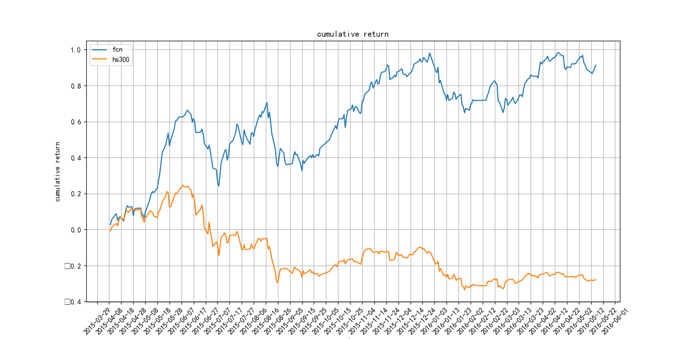
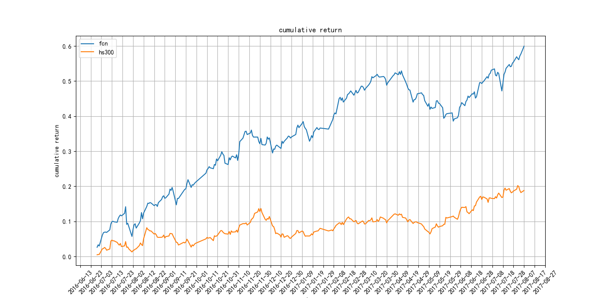
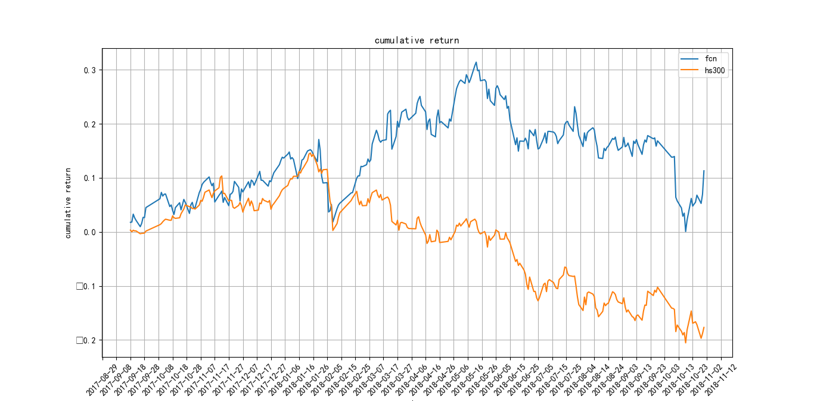
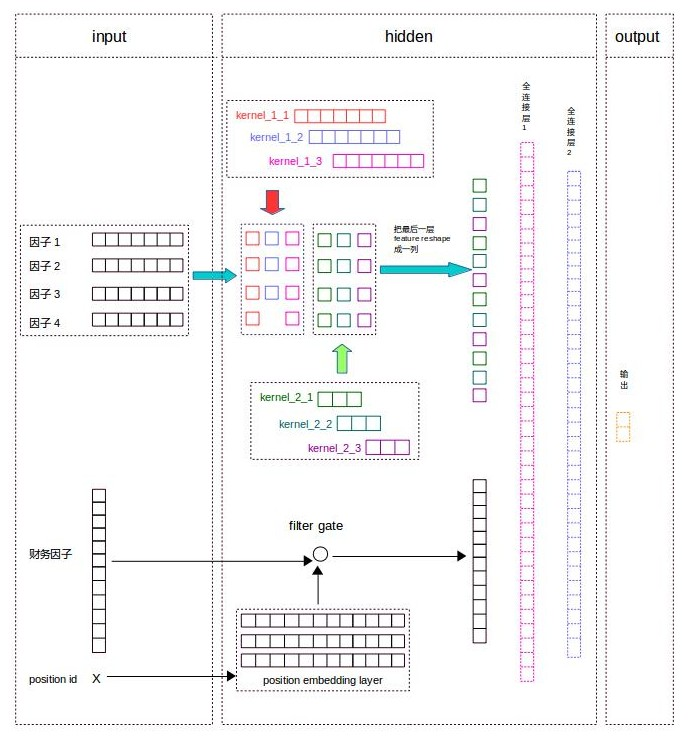
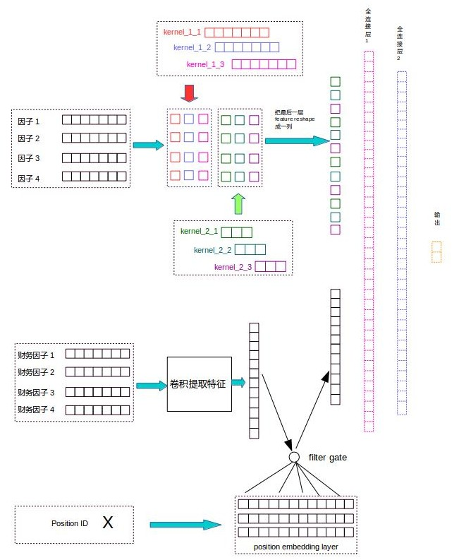

## 第三阶段任务总结及成果分析展示

### 主要工作内容

分析财报数据，尝试将财报数据与技术类数据进行整合，目前还没有整合成功

### 实验

1. 原模型时序稳定性测试																																																																																																																																																																																																																																																																																																																																																																																																																																																																																																																																																																																																																																																																																																												

2. 在原模型基础上加上单期财务报表，效果表现不好

3. 在原模型基础上加上四期财务报表，效果表现不好

   **然后发现了有关于财务数据的一些问题**

4. 单独对财务指标进行建模，发现每年的财务数据不是独立同分布

5. 阅读券商的基本面分析研报，发现他们的基本面选股方法都是基于数据分箱，于是进行了财务数据分箱的实验

6. 财务数据分箱后做特征交叉．

### 遇到的问题

1. 财务报表来源：定期报告，招募说明书，上市公告书，换股报告书

2. 财务报表合并类型：合并本期，合并上期

3. 财务报表公布日期：
   年度报告由上市公司在每个会计年度结束之日起4个月内编制完成（即一至四月份）

   中期报告由上市公司在半年度结束后两个月内完成（即七、八月份）

   季报由上市公司在会计年度前三个月、九个月结束后的三十日内编制完成（即第一季报在四月份，第三季报在十月份）

   由于财务报表发布时间的问题，所以可能会造成下面的情况：

   3月份调仓拿不到上一年的财务报表

   4月份调仓拿不到一季度的财务报表

   8月份调仓拿不到二季度的财务报表

   10月份调仓拿不到三季度的财务报表

   所以对财务进行了单独的实验：设置调仓日期为5月1日，9月1日，11月1日，每次调仓选取上一季度财报和上一年季报．

### 实验详情

1. **原模型时序稳定性测试**

   **训练数据：**2005-01-04~2015-04-09

   **回测时间：**2015-04-09~2016-05-16

   ​		   2016-06-29~2017-08-07

   ​		   2017-09-18~2018-10-31

   **结论：**利用训练得到的模型在上述三个时间段内回测，回测结果均比沪深300要好，表明训练得到的模型具有时间稳定性．

   **回测结果如下：**

   | 回测时间              | accurancy | fcn累计收益率 | hs300累计收益率 |
   | --------------------- | --------- | ------------- | --------------- |
   | 2015-04-09~2016-05-16 | 0.5762    | 86.64%        | -27.95%         |
   | 2016-06-29~2017-08-07 | 0.5984    | 57.73%        | 18.82%          |
   | 2017-09-18~2018-10-31 | 0.5720    | 6.93%         | -17.68%         |

   2015-04-09~2016-05-16回测效果图：

   

   2016-06-29~2017-08-07回测效果图：

   

   2017-09-18~2018-10-31回测效果图：

   

2. **在原模型基础上加上单期财务报表，效果表现不好**

   **加入单期财务报表的模型结构：**

   

   财务报表一年只发布四期，而我们是按月度进行调仓，为了将财务指标和技术类的相融合，引入了filter gate，filter gate是一个sigmoid函数，它的作用是随着最近一期财报发布时间的推移，逐渐降低财报对选股的影响．

   比如调仓日是2015-04-15，最近一期财报是2015年第一季报，它的position id就是0．

   比如调仓日是2015-05-15，最近一期财报还是2015年第一季报，它的position id就是1，因为中间相隔了一个月．

   比如调仓日是2015-06-15，最近一期财报还是2015年第一季报，它的position id就是2，因为中间相隔了两个月．

   position embedding layer是position id的隐向量，长度和财务因子长度一样，经过filter gate后就会产生长度和财务因子一样的取值在0~1之间的filter 向量，这样就可以对财务因子对选股的影响进行过滤．

   **测试结果如下：**

   | 测试时间段            | fin_fcn accurancy | fcn accurancy |
   | --------------------- | ----------------- | ------------- |
   | 2016-06-29~2017-08-07 | 0.5979            | 0.5984        |
   | 2017-09-18~2018-10-31 | 0.5691            | 0.5720        |

3. **在原模型基础上加上四期财务报表，效果表现不好**

   失败总结：可能单期的财务报表并没有可比性，所以对选股的影响并不明显．加入四期财务报表，提取四期财务因子的变化情况，最后在用filter gate进行过滤．

   于是产生了如下模型结构：

   

   利用类似与技术因子的卷积结构也提取四期财务因子的变化特征，对提取特征后的vector用filter gate进行过滤．

   测试结果如下：

   | 测试时间段            | fin_fcn accurancy | fcn accurancy |
   | --------------------- | ----------------- | ------------- |
   | 2016-06-29~2017-08-07 | 0.5880            | 0.5984        |
   | 2017-09-18~2018-10-31 | 0.5647            | 0.5720        |

4. 单独对财务指标进行建模，发现每年的财务数据不是独立同分布

   由于财务指标发布时间的原因，所以我们设定调仓日期为每年的5月1日，9月1日，11月1日，但是这种设置每次都会忽视上一年的年报，所以每次调仓时我们选取最近一季度财报和上一年年报作为X．

   模型选用的是基于决策树的分类模型lightGBM．

   实验结果如下：

   | 回测时间              | accurancy |
   | --------------------- | --------- |
   | 2015-04-09~2016-05-16 | 0.5833    |
   | 2016-06-29~2017-08-07 | 0.4954    |
   | 2017-09-18~2018-10-31 | 0.5259    |

5. 阅读券商的基本面分析研报，发现他们的基本面选股方法都是基于数据分箱，于是进行了财务数据分箱的实验

   将所有财务指标行业市值中性化后，从小到大排序，总共分成４箱，0\~25%，25%\~50%，50%\~75%，75%~100%．

   模型还是选用的基于决策树的分类模型lightGBM．

   实验结果如下：

   | 回测时间              | accurancy |
   | --------------------- | --------- |
   | 2015-04-09~2016-05-16 | 0.5921    |
   | 2016-06-29~2017-08-07 | 0.5044    |
   | 2017-09-18~2018-10-31 | 0.5379    |

6. 财务数据分箱后做特征交叉．

   后来又在分箱的基础上做了特征交叉，这样做的原理是基于这样的选股规则＂EP在top25%同时净资产收益率在top25%，同时净现金流在top25％的股票比较好＂．

   做了特征交叉后的试验后发现，准确率相比于单纯分箱还要低而且模型还是时间不稳定．

   实验结果如下：

   | 回测时间              | accurancy |
   | --------------------- | --------- |
   | 2015-04-09~2016-05-16 | 0.5764    |
   | 2016-06-29~2017-08-07 | 0.5097    |
   | 2017-09-18~2018-10-31 | 0.5353    |

### 附录

#### 财务因子

| 因子类别          | 因子(AEA)                             | 因子代码 |
| ----------------- | ------------------------------------- | -------- |
| 每股因子          | 每股收益                              | AEA001   |
|                   | 基本每股收益                          | AEA002   |
|                   | 稀释每股收益                          | AEA003   |
|                   | 扣除非经常性损益每股收益              | AEA004   |
|                   | 每股未分配利润                        | AEA005   |
|                   | 每股净资产                            | AEA006   |
|                   | 每股资本公积金                        | AEA008   |
|                   | 每股现金流量净额（TTM）               | AEA009   |
|                   | 每股经营活动产生的现金流量净额（TTM） | AEA010   |
| 盈利能力因子      | 营业利润/营业收入（TTM）              | AEB001   |
|                   | 销售税金率（TTM）                     | AEB002   |
|                   | 营业总成本/营业总收入（TTM）          | AEB003   |
|                   | 净资产收益率（TTM）                   | AEB004   |
|                   | 净资产收益率(扣除非经常性损益)        | AEB005   |
|                   | 净资产收益率-加权                     | AEB006   |
|                   | 净资产收益率-加权(扣除非经常性损益)   | AEB007   |
|                   | 净资产收益率-平均                     | AEB008   |
|                   | 投资收益率                            | AEB009   |
|                   | 总资产报酬率（TTM）                   | AEB010   |
|                   | 净利润/营业总收入（TTM）              | AEB011   |
|                   | 管理费用/营业总收入（TTM）            | AEB012   |
|                   | 财务费用/营业总收入（TTM）            | AEB013   |
|                   | 成本费用利润率（TTM）                 | AEB014   |
|                   | 三费比重                              | AEB015   |
|                   | 扣除非经常性损益后的净利润            | AEB016   |
|                   | 销售毛利率（TTM）                     | AEB017   |
|                   | 销售期间费用率（TTM）                 | AEB018   |
|                   | 基本获利能力                          | AEB019   |
| 收益质量因子      | 非经常性损益合计                      | AEC001   |
|                   | 净利含金量                            | AEC002   |
|                   | 非经常性损益占比                      | AEC003   |
|                   | 年化期间费用毛利比                    | AEC004   |
| 现金流量因子      | 经营活动现金净流量与净利润比率        | AED001   |
|                   | 营业收入现金含量                      | AED002   |
|                   | 全部资产现金回收率                    | AED003   |
|                   | 现金转换周期                          | AED004   |
| 资本结构因子      | 流动资产比率                          | AEE001   |
|                   | 货币资金比率                          | AEE002   |
|                   | 存货比率                              | AEE004   |
|                   | 固定资产比率                          | AEE005   |
|                   | 负债结构比                            | AEE006   |
|                   | 净资产比率                            | AEE007   |
|                   | 资产负债比率                          | AEE008   |
|                   | 非流动负债比率                        | AEE009   |
|                   | 流动负债比率                          | AEE010   |
|                   | 有形资产净值债务率                    | AEE011   |
|                   | 资产现金回收率（TTM）                 | AEE012   |
|                   | 应收账款占比                          | AEE013   |
| 偿债能力因子      | 产权比率                              | AEF001   |
|                   | 流动比率                              | AEF002   |
|                   | 速动比率                              | AEF003   |
|                   | 现金比率                              | AEF004   |
|                   | 营运资金                              | AEF006   |
|                   | 保守速动比率                          | AEF007   |
|                   | 经营净现金比率（短期债务）            | AEF009   |
|                   | 经营净现金比率（全部债务）            | AEF010   |
| 营运能力因子      | 应收账款周转率（TTM）                 | AEG001   |
|                   | 存货周转率（TTM）                     | AEG002   |
|                   | 运营资金周转率                        | AEG003   |
|                   | 总资产周转率（TTM）                   | AEG004   |
|                   | 固定资产周转率（TTM）                 | AEG005   |
|                   | 应收账款周转天数（TTM）               | AEG006   |
|                   | 存货周转天数（TTM）                   | AEG007   |
|                   | 流动资产周转率（TTM）                 | AEG008   |
|                   | 流动资产周转天数                      | AEG009   |
|                   | 总资产周转天数                        | AEG010   |
|                   | 股东权益周转率                        | AEG011   |
| 成长类因子        | 营业收入增长率                        | AEH001   |
|                   | 净利润增长率                          | AEH002   |
|                   | 净资产增长率                          | AEH003   |
|                   | 固定资产增长率                        | AEH004   |
|                   | 总资产增长率                          | AEH005   |
|                   | 投资收益增长率                        | AEH006   |
|                   | 营业利润增长率                        | AEH007   |
|                   | 期间费用增长率                        | AEH008   |
| 财报衍生因子(TTM) | 营业总收入（TTM）                     | AEI001   |
|                   | 营业收入（TTM）                       | AEI002   |
|                   | 营业总成本（TTM）                     | AEI003   |
|                   | 营业税金及附加（TTM）                 | AEI004   |
|                   | 销售费用（TTM）                       | AEI005   |
|                   | 管理费用（TTM）                       | AEI006   |
|                   | 财务费用（TTM）                       | AEI007   |
|                   | 资产减值损失（TTM）                   | AEI008   |
|                   | 营业利润（TTM）                       | AEI009   |
|                   | 利润总额（TTM）                       | AEI010   |
|                   | 所得税（TTM）                         | AEI011   |
|                   | 净利润（TTM）                         | AEI012   |
|                   | 归属母公司股东的净利润（TTM）         | AEI013   |
|                   | 少数股东损益（TTM）                   | AEI014   |
|                   | 经营活动现金净流量（TTM）             | AEI016   |
|                   | 现金及现金等价物净增加额（TTM）       | AEI019   |